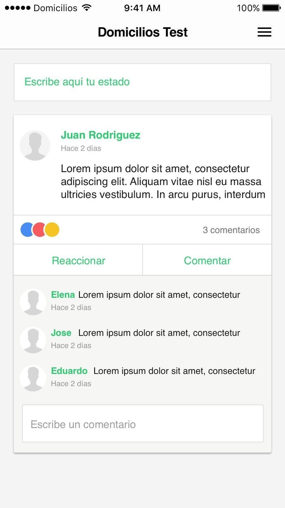
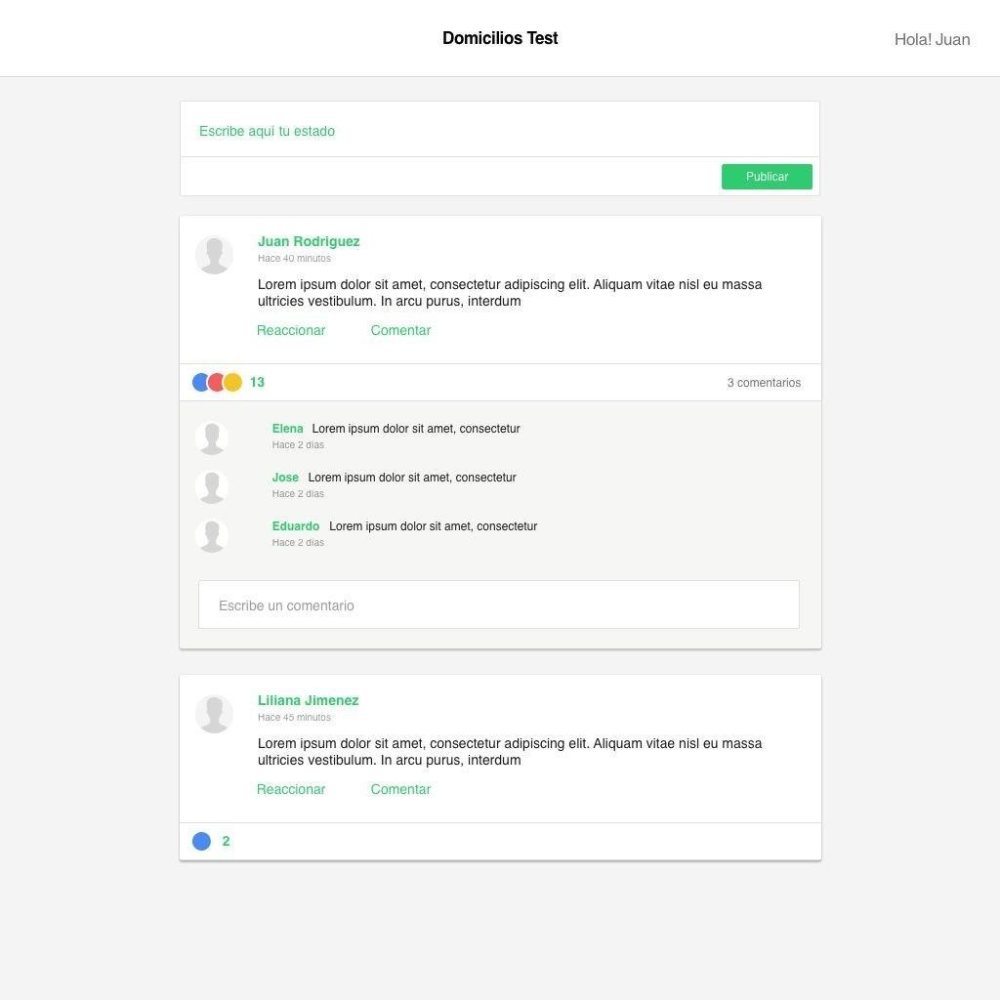
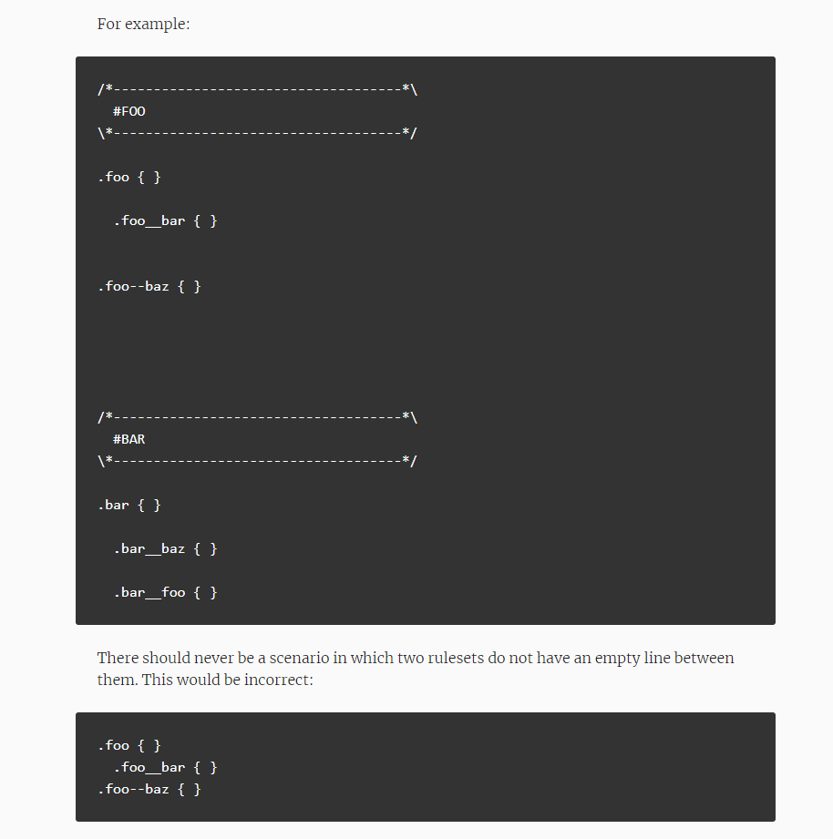
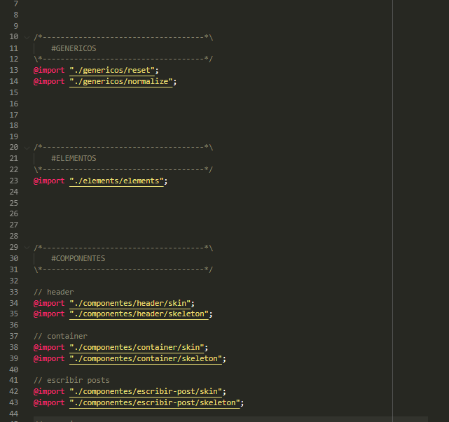
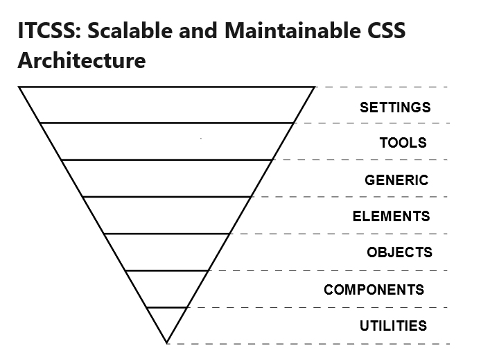
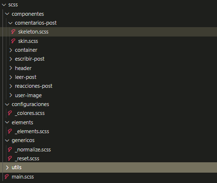
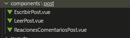
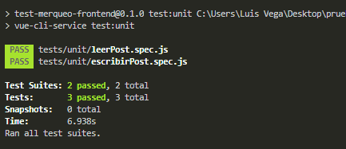

# Prueba técnica Frontend Developer

## Planteamiento de la prueba

La prueba consiste en una plataforma de publicaciones y comentarios que debe ser realizada usando **VUE** y preferiblemente **SASS**, **ES6**, **Webpack**. Se evaluará tanto la capacidad para llevar a la vida el diseño lo más aproximado a la proyección inicial como la lógica que se utilice para desarrollar las funciones de publicar, reaccionar y responder a un comentario

<table>
    <tr>
        <td></td>
        <td></td>
    </tr>
</table>

# Propuesta de la solución

## Desarrollo estilos
para el desarrollo de los estilos se implemento el preprocesador **SASS** usando las sugerencias establecidas en el documento http://cssguidelin.es/, para el nombramiento de clases patrones de HTML y patrones de css

<table>
    <tr>
        <td></td>
        <td></td>
    </tr>
</table>


## Arquitectura de carpetas utilizadas para los estilos
con el objetivo de establecer una arquitectura escalable y sostenible adopte las sugerencias establecidas en el documento https://www.xfive.co/blog/itcss-scalable-maintainable-css-architecture/


<table>
    <tr>
        <td></td>
        <td></td>
    </tr>
</table>


## Desarrollo VUE
acorde al planteamiento de la prueba y teniendo en cuenta de que se esta evaluando el manejo del FrontEnd decidí no implementar un backend para sostener la vista, la alternativa que estableci es **VUEX** con el cual se maneja el estado de los componentes en cada momento.


## Estructura de carpetas VUE
Debido a la simplicidad de la prueba he decidido implementar 3 componentes, los cuales defino como EscribirPost.vue, LeerPost.vue, ReaccionesComentariosPost.vue. con el ultimo conclui que la mejor opcion fue hacer un solo componente, ya que los dos tipos de interaciones (Reaccionar y Comentar) estaban estrechamente relacionados entre si en el lado de HTML. 



La estructura de carpetas es muy sencilla ya que la funcionalidad de los tres componentes mencionados anteriormente impactan sobre la misma entidad, que en este caso es **POST**, la cual lleva el nombre de su carpeta


en caso de ampliar mas componentes como por ejemplo el caso de los usuarios (que aun los estoy definiendo) tambien se estableceria en una carpeta al mismo nivel de post, la cual contendria todos los componentes que realizan acciones sobre esta entidad.


## Pruebas Unitarias

Se realiza un total de 2 pruebas unitarias, las cuales estan destinadas a probar las funciones de leer post y escribir post, 




# Instrucciones de Despliegue

### Clonar el repositorio
```````
    git clone 'http://github.com/url-del-repositrio'
```````

### Acceder a la carpeta del proyecto
```````
    cd 'nombre-de-carpeta-de-proyecto'
```````

## Descargar las dependencias con el siguiente comando
```
npm install
```

### Para ejecutar un servidor de prueba 
```
npm run serve
```
luego valla a   `http://localhost:8080/` para ver el proyecto en ejecucion 

### Compilar y minificar para produccion
```
npm run build
```
este comando genera una carpeta `dist` la cual debe ser alojada en un servidos en la carpeta publica

### Ejecutar pruebas unitarias
```
npm run test:unit
```
